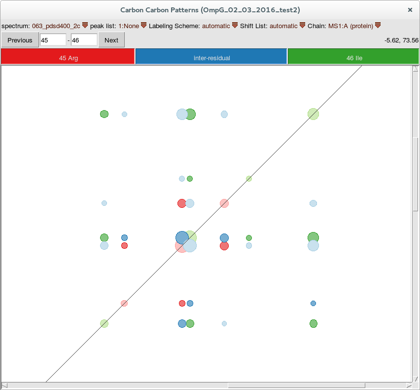

# ccpnmr-cc-patterns
Visualize cross-peak patterns in 2D 13C-13C correlation spectra based on labeling schemes and present assignments

This is a plug-in for [CCPN Analysis](http://www.ccpn.ac.uk/software/analysis) version 2 and is meant to visualize cross-peak patterns in NMR spectra.

I wrote this plug-in to see which peaks are expected in 13C-13C correlation spectra when using specific labeling schemes. This idea is inspired on the figures in the supplementary information of the article mentioned in the references.

It is nice to have such diagrams as a plug-in for CCPN Analysis for several reasons. The location of the peaks can actually be based on the chemical shift from one of the shift lists in the Analysis project. If no shift assignment is made yet average shifts from the [refDB](http://refdb.wishartlab.com/) are used. Also, on paper it is not easily possible to show all the expected patterns for inter-residual cross-peaks for all combinations of amino acids as it would take 20 x 20 = 400 figures.

The expected peaks in the pattern are colored dark when a peak with corresponding assignment is present in the selected peak list, which gives gives a quick overview of the assign status of a spectrum. When the hovering the mouse over the diagram you get information about the assignment status of the atoms that are correlated and the cross-hairs will move in the spectra windows. Just try it out.

##Instalation
Just clone this repository or download the zip-archive using the 'Download ZIP' button. Unpack the zip file in somewhere you like. Then just open CCPN Analysis and add this macro as follows:

1. Go to Menu -> Organize Macros -> Add Macro
2. navigate to the location you unpacked the archive and select 'start_cc_pattern_plugin.py'.
3. In the bottom half of the dialog select 'start_cc_diagrams' and press 'Load Macro'.
4. Now the macro should appear in the list of macros, you can select it and hit 'Run'.

## References
Assigning large proteins in the solid state: a MAS NMR resonance assignment strategy using selectively and extensively 13C-labelled proteins
Journal of Biomolecular NMR, 2009, Volume 44, Number 4, Page 245
Victoria A. Higman, Jeremy Flinders, Matthias Hiller, Stefan Jehle, Stefan Markovic, Sebastian Fiedler, Barth-Jan Rossum, Hartmut Oschkinat 
http://link.springer.com/article/10.1007/s10858-009-9338-7